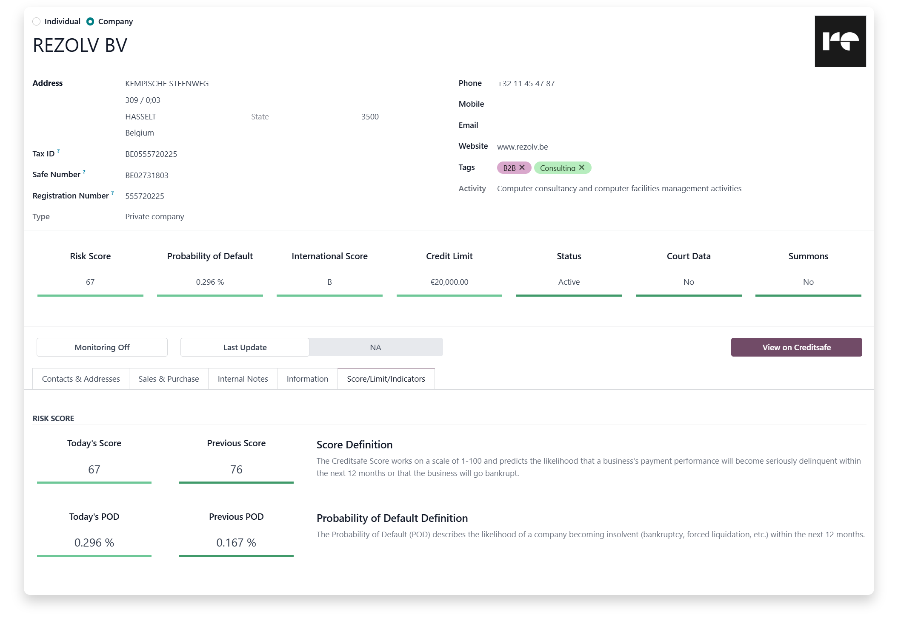

    <h1>We think you’re gonna like our Creditsafe × Odoo integration</h1>

 

    <a href="https://rezolv.be/graydon-creditsafe-integratie"><kbd>   &nbsp;&nbsp; <b> More info </b> &nbsp;&nbsp;     </kbd></a>
    &nbsp;&nbsp;&nbsp;&nbsp;&nbsp;&nbsp;&nbsp;&nbsp;
    <a href="mailto:info@rezolv.be"><kbd>   &nbsp;&nbsp; <b> Inquiries </b> &nbsp;&nbsp;     </kbd></a>
    &nbsp;&nbsp;&nbsp;&nbsp;&nbsp;&nbsp;&nbsp;&nbsp;
    <a href="mailto:support@rezolv.be"><kbd>   &nbsp;&nbsp; <b> Collaborate </b> &nbsp;&nbsp;     </kbd></a>

 

Creditsafe × Odoo by Rezolv: reliable company data, credit checks, and compliance inside Odoo.

- Instant company profiles and credit scores in Odoo
- Compliance checks (KYC, PEP, AML, UBO) with a clear audit trail
- Automatic updates and monitoring with change alerts
- Fits sales, purchasing, and compliance flows
- Available for Odoo 17, 18 and 19; activated via Rezolv — GraydonCreditsafe’s official integration partner

 

    
<strong>Rezolv BV</strong> ● Kempische Steenweg 309/0.03, 3500 Hasselt, Belgium ● +32 11 870 863 ● <a href="mailto:info@rezolv.be">info@rezolv.be</a>

